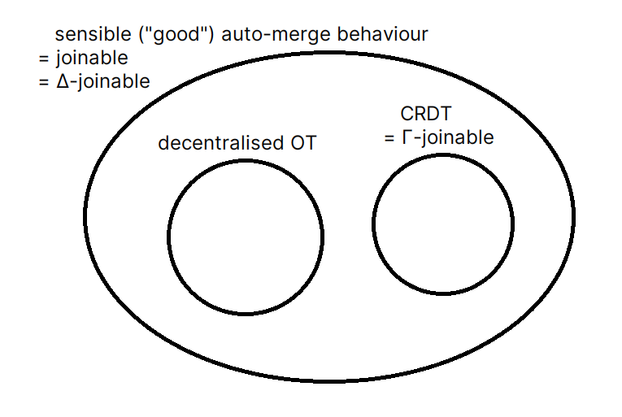

# Statecore

State management all-in-one.

## Project outline

This library can be divided into four components:

- [x] **The "joinable" framework:** provides [general abstractions](docs/state-management-theory.pdf) for [CRDT](https://en.wikipedia.org/wiki/Conflict-free_replicated_data_type) and [OT](https://en.wikipedia.org/wiki/Operational_transformation)-based synchronisation strategies.
- [ ] **The "persistent" framework:** provides abstractions for storing joinable structures into local databases, synchronises with remote sources, and garbage-collects modification histories.
- [ ] **The "observable" framework:** provides abstractions for propagating changes from joinable structures to external states like UI content (i.e. the [observer pattern](https://en.wikipedia.org/wiki/Observer_pattern)).
- [ ] **The object graph:** a "joinable", "persistent" and "observable" graph for storing arbitrary `struct`s, and macros for transforming `struct` definitions to objects linked to the graph (i.e. the [active record pattern](https://en.wikipedia.org/wiki/Active_record_pattern)).

Hopefully this will enable us to develop countless mobile apps (with seamless data persistence and synchronisation) quickly, without any special effort on state management!

## Implementing new CRDTs

> Within this document, the term _CRDT_ refers to _convergent replicated data types_ (i.e. _CvRDT_ in literature) by default. The other variant, _CmRDT_, is not _by itself_ a suitable model for collaborative editing; they can, however, be _modelled_ as CvRDT by using "event logs" (which are instances of CvRDT).

1. Design an internal state representation for your data type.
2. Implement the `joinable::{State, Joinable}` traits. They generalise all CRDTs and OTDTs.
3. Implementation for `joinable::Joinable::{preq, join}` need not to be efficient. If your data type is a _delta-state_ CRDT, implement `joinable::GammaJoinable` instead.
   - You will find `joinable::GammaJoinable::gamma_join`, if exists, equivalent to `joinable::State::apply`.
4. Decide how changes to your data structure will be delivered to external observers (coarse-grained vs. fine-grained, etc.)
5. Wrap your structure in a new type and implement the `observable::Observable` trait.
   - The new type should also implement `joinable::Joinable` and `joinable::GammaJoinable` by delegating calls. In `joinable::{State::apply, Joinable::join, GammaJoinable::gamma_join}`, calculate a "change set" from the current state and incoming action, and use it to determine which observers should be notified.
6. Decide how your data structure will be stored in a local database (bulk-load vs. lazy-load, etc.)
7. Wrap your structure in a new type and implement the `persistent::Persistent` trait.
   - You may want to make use of `persistent::{Controller, History}`.
   - Database interfaces suffixed with `Store` can be reused. For complex queries, you may need to define and implement your own `Store`.

## Implementing new OTDTs

> Within this document, the term _OTDT_ refers to _operation-transformed data types_, and specifically the ones that _do not rely on a canonical source of event ordering_ (i.e. decentralised).

1. Design an internal state representation for your data type.
2. Implement the `joinable::{State, Joinable}` traits. They generalise all CRDTs and OTDTs.
3. Implementation for `joinable::Joinable::{preq, join}` need not to be efficient. If your data type is an OTDT, implement `joinable::{DeltaJoinable, Restorable}` instead.
4. (TODO)
